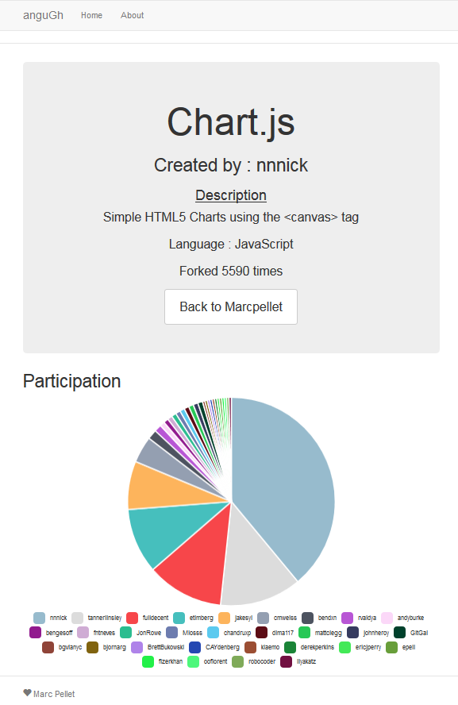

#Introduction
Ce travail a été réalisé dans le cadre du cours de TWEB à l'HEIG-VD à Yverdon. Il fait office de deuxième note de travail écrit pour le semestre. Pour ce travail nous avions à choix quatres sujets, j'ai choisi le numéro deux qui consiste à réaliser une application Angular utilisant l'API de github afin d'afficher des informations sur les utilisateurs et les repos qui leur sont associés.

#Technologies Utilisées
Comme base de travail j'ai choisi d'utiliser le générateur Angular (https://github.com/yeoman/generator-angular), ce qui c'est avéré être un mauvais choix lors du déployement mais ceci sera expliqué plus en détail plus tard.
Voici la liste des technologies utilisées:
* Angular 
* Bootstrap pour tous ce qui est design.
* Ui-router pour la navigation dans l'application.
* Api gitHub pour récupérer les informations nécessaires.
* Chart.js pour afficher l'affichage de graphiques.

#Interface
l'application a été déployée sur GitHub Pages, elle est disponible [ici](http://marcpellet.github.io/tweb-te2-ghpages/).

L'interface proposée est très simple elle est constituée de trois pages:
* Acceuil où l'utilisateur peut rentrer le nom GitHub à rechercher
* Page d'information sur l'utilisateur recherché qui fournit des détails sur l'utilsateur ainsi des liens vers tous ses repos
* Page d'information sur le repo qui contient des détails sur le repo ainsi qu'un graphique affichant les personnes ayant participé au repo ainsi que le nombre de commit.

#Difficultés Rentcontrées
Cette exercice était dans l'ensemble pas trop difficile j'ai quand même rencotré quelques difficultés durant le développement:
* L'API GitHub est très bien documentée et relativement simple, cependant elle met une limite de 60 requêtes par heure pour un utilisateur non connecté. Ce nombre n'est absolument pas suffisant pour tester l'application pendant le développement car une page peut contenir plusieurs requêtes. J'ai donc dû trouver un moyen de le contourner, une pair client_id + client_secret a été générée et ajoutée à toutes les requêtes à l'API. Cette solution n'est pas très propre ni très sécuritaire mais elle avait le mérite d'être simple et suffisante pour cette petite application.
* Il était demandé de déployer l'application sur heroku. Cependant, comme dit plus tôt, le choix du générateur n'a pas été très judicieux. En effet, le générateur Angular utilisé ne mets pas en place de seveur ce qui rend le déployement sur heroku impossible en l'état. Après un long moment de recherche, le déployement sur heroku a été abandonné et j'ai pris le partit de déployer l'application sur GitHub Pages qui gère parfaitement les sites statiques.

#Conclusion
Ce fût un exercice relativement intéressant qui m'a permis de constaté que ce semestre passé sur le projet de TWEB m'a appris beaucoup de choses sur Angular et les différentes librairies associée. J'ai cependant été un peu déçu de constater que rien qu'en changeant de générateur (Angular au lieu de Express MVC pour le projet) , je me suis retrouvé perdu dans l'architecture du projet et qu'il m'a fallut un temps non négligeable pour retrouver ou mettre les différents fichiers pour que cela fonctionne correctement. Je pense avoir rempli le cahier des charges, bien que mon application est très sommaire, tous les points demandés ont été traités.
